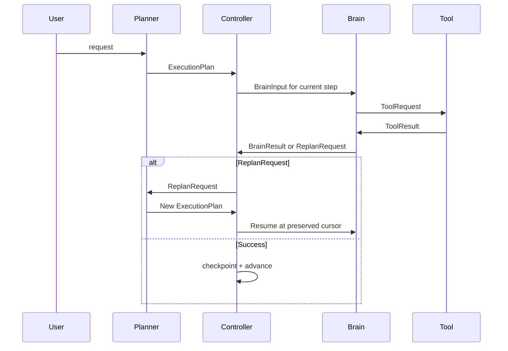

## CortexNode Architecture Document

### 1. Intent
CortexNode needs a deterministic execution engine for local-first AI software engineering tasks. The architecture must keep workflow control out of the LLM, preserve replayability, and make checkpointing a first-class property of the execution model.

### 2. Architecture Overview
The target lifecycle is:
User -> Planner -> Controller -> Brain -> Tool -> Brain -> Controller -> ... -> Summary

Core responsibilities:
- Planner creates and revises an ExecutionPlan.
- Controller owns execution progress, retries, iteration, stopping conditions, checkpointing, and replanning orchestration.
- Brain executes one step at a time, evaluates tool observations, validates success, and emits structured output or ReplanRequest.
- Tool execution is deterministic and scoped to a single ToolRequest.
- Summary consumes execution logs only and produces the final report.

Design principles:
- Single responsibility per node
- Deterministic transitions
- Replayable execution from checkpoint
- Structured state instead of implicit conversational control
- One writer per field
- No LLM-owned workflow control
- Future Redis checkpointing should be an infrastructure swap, not an architecture change
- Future SCADA tools should use the same execution contract as local tools

### 3. Scope and Boundaries
Included:
- Planning, step execution, tool invocation, replanning, and summary contracts
- State ownership and lifecycle transitions
- Checkpoint-resume compatibility
- Suggested LangGraph node layout
- Extension points for Memory, Redis, SCADA, and MCP

Excluded:
- Implementation code
- Feature work outside execution control
- Tool capability redesign beyond deterministic adapters

### 4. Final Diagram Set
Architecture diagram:
User -> Planner -> Controller -> Brain -> Tool -> Brain -> Controller -> ... -> Summary

Controller-centered execution loop:
- Planner returns the execution plan only.
- Controller selects the next step and owns progress state.
- Brain evaluates exactly one step and returns a structured result or ReplanRequest.
- Tool returns only ToolResult.
- Summary reads the execution record and generates the final answer.

Sequence diagram:
User request -> Planner creates plan -> Controller stores plan and initializes execution state -> Brain receives one step -> Tool executes request -> Brain interprets result -> Controller advances or replans -> Summary finalizes if complete.

State contract diagram:
ExecutionState contains the plan, progress, checkpoints, and execution record.
ExecutionPlan contains ordered ExecutionStep entries and revision metadata.
ExecutionStep contains step identity, dependency info, status, and step-local inputs/outputs.
ExecutionContext contains the stable environment needed for step execution.
BrainInput combines the selected step with the relevant execution context.
BrainResult reports step outcome, tool needs, validation, and next-action intent.
ToolRequest and ToolResult form a deterministic request/response pair.
ControllerDecision records the controller’s next move.
ReplanRequest preserves the reason for replanning and the preserved execution history.
ExecutionSummary reads logs only and produces the final report.

### 5. State Ownership Matrix
Rule:
Every field has exactly one writer. Read access may be shared, but mutation may not be shared.

Ownership matrix:
| State Item | Created by | Updated by | Read by | Notes |
| ExecutionState | Controller | Controller | Planner, Brain, Summary | Authoritative checkpointed runtime state |
| ExecutionPlan | Planner | Planner | Controller, Brain, Summary | Immutable once accepted until replanning |
| ExecutionStep | Planner | Planner only for plan revision; Controller updates only step status metadata if modeled separately | Controller, Brain, Summary | Step definition should remain stable |
| ExecutionContext | Controller | Controller | Brain, Tool, Summary | Holds stable runtime inputs and environment facts |
| BrainInput | Controller | Controller | Brain | Derived execution payload for one step |
| BrainResult | Brain | Brain | Controller | Contains validation outcome and any replan request |
| ToolRequest | Brain | Brain | Tool, Controller | Deterministic request envelope |
| ToolResult | Tool | Tool | Brain, Controller, Summary | Deterministic tool output envelope |
| ControllerDecision | Controller | Controller | Brain, Summary | Records next action and stopping reason |
| ReplanRequest | Brain | Brain | Controller, Planner | Structured replanning trigger |
| ExecutionSummary | Summary | Summary | User, Controller | Final narrative only |

Ownership summary:
- Planner owns plan creation and revision metadata.
- Controller owns progress, retries, iteration count, checkpoint state, and the resume cursor.
- Brain owns step-local reasoning output and replanning requests.
- Tool owns deterministic result payloads.
- Summary owns the final execution narrative only.

### 6. Node Contracts
Each node has explicit inputs, outputs, preconditions, postconditions, failure modes, and recovery strategy.

Planner:
- Inputs: user intent, execution context, optional replan trigger.
- Outputs: ExecutionPlan.
- Preconditions: request is structurally valid.
- Postconditions: plan is ordered, checkpoint-safe, and accepted by Controller.
- Failure modes: ambiguous intent, unsupported task shape, invalid plan output.
- Recovery strategy: return a clarification state or a structured replanning-friendly plan.

Controller:
- Inputs: current ExecutionState and latest BrainResult or ToolResult.
- Outputs: ControllerDecision and updated ExecutionState.
- Preconditions: an accepted plan exists, or a replan has been requested.
- Postconditions: one execution transition is committed and checkpointed.
- Failure modes: timeout, stale plan revision, exceeded retries, missing completion signal.
- Recovery strategy: resume from checkpoint, trigger replan, or terminate with a structured stop reason.

Brain:
- Inputs: one ExecutionStep, relevant context, and the current execution record.
- Outputs: BrainResult or ReplanRequest.
- Preconditions: the selected step is active and the context is stable.
- Postconditions: step outcome is validated or replanning is requested.
- Failure modes: invalid tool usage, empty response, failed validation, inability to complete step.
- Recovery strategy: emit a structured failure or a structured replan request.

Tool:
- Inputs: ToolRequest.
- Outputs: ToolResult.
- Preconditions: request is deterministic and sandbox-safe.
- Postconditions: requested operation is complete and serialized.
- Failure modes: validation error, sandbox error, tool runtime failure.
- Recovery strategy: return a structured failure result; never reason or retry internally.

Summary:
- Inputs: execution logs, accepted plan, completed step history, final outcomes.
- Outputs: ExecutionSummary.
- Preconditions: execution reached a terminal or handoff state.
- Postconditions: final report is complete and independent of internal reasoning traces.
- Failure modes: incomplete execution log, missing terminal state.
- Recovery strategy: summarize what is known and explicitly surface missing information.

### 7. Lifecycle and Transitions
The lifecycle is Planner -> Controller -> Brain -> Tool -> Brain -> Controller.

Planner -> Controller:
- Planner creates the accepted ExecutionPlan.
- Controller initializes execution state, the resume cursor, counters, and checkpoint metadata.
- The plan becomes the authoritative execution structure.

Controller -> Brain:
- Controller selects the next active step and builds BrainInput.
- Only the current step and stable context are exposed.
- Future step ordering is not mutable here.

Brain -> Tool:
- Brain emits a deterministic ToolRequest if a tool is needed.
- Tool execution is limited to the requested operation.
- ToolResult is captured without interpretation.

Tool -> Brain:
- Brain consumes ToolResult and validates step completion.
- Brain may emit a successful result or a ReplanRequest.
- Completed step state becomes immutable.

Brain -> Controller:
- Controller records the BrainResult, advances the resume cursor, increments retries or iteration counters as needed, and writes a checkpoint.
- If a ReplanRequest exists, Controller forwards it to Planner while preserving completed work.

### 8. Replanning
Replanning is controller-mediated and structured.

Replanning rules:
- Replanning is allowed only when Brain cannot safely complete the current step or detects plan invalidation.
- Completed steps remain immutable and are not rerun unless explicitly invalidated by policy.
- Controller preserves completed work, execution logs, and stable context.
- The new plan must record revision lineage so replay is auditable.

### 9. Checkpoint Contract
Checkpointing occurs after every meaningful transition.

Checkpoint contents:
- Accepted ExecutionPlan and revision metadata
- Current step cursor and step status history
- Controller counters and stop reasons
- Last BrainResult, ToolResult, and any ReplanRequest
- Execution log or append-only transition history, if used

Resume requirements:
- The current execution cursor must be recoverable.
- Completed steps must be distinguishable from pending steps.
- Tool results must remain readable as structured state.

### 10. LangGraph Layout
The current graph should be evaluated against the controller-owned model.

Recommended layout:
- Planner node: create and revise plans
- Controller node: own the execution loop and checkpoint writes
- Brain node: evaluate one step
- Tool node: execute deterministic requests
- Capture node, if retained: normalize tool outputs only
- Summary node: generate final output from execution logs

Preferred decision:
- Use an explicit Controller node if checkpoint fidelity and replay clarity are the priority.
- Keep orchestration thin so the Brain does not secretly own workflow control.

### 11. Extension Points
The design should explicitly reserve extension hooks for:
- Memory persistence
- Redis checkpoint store
- SCADA tool adapters
- MCP integration

### 12. Relevant Files
- `core/graph.py` — graph assembly and node wiring
- `core/state.py` — current shared state shape to be decomposed
- `core/graph_planner.py` — planner behavior and plan output
- `core/graph_brain.py` — step execution and recovery logic
- `core/graph_state_machine.py` — deterministic transition and stopping rules
- `core/graph_nodes.py` — node factory layer to align with the new ownership model
- `core/graph_capture.py` — tool-result normalization and state capture
- `core/graph_runner.py` — runtime execution and observability
- `core/models.py` — structured tool/result models that can inform the new contracts
- `main.py` — current manual session persistence and resume flow
- `tests/test_graph.py` — graph assembly and dependency injection seams
- `tests/test_graph_planner.py` — planner route and plan-shaping behavior
- `tests/test_graph_nodes.py` — node guard and transition behavior
- `tests/test_graph_runner.py` — lifecycle and replay observability
- `knowledge_bk/notes_improvement` — source requirements for the architecture task

### 13. Verification Criteria
The architecture is complete when it can answer these questions without ambiguity:
- Which node owns each field?
- Which state changes occur at each transition?
- How does replanning preserve completed work?
- What exactly is checkpointed?
- How can a future Redis saver resume without design changes?
- How do Summary and SCADA fit without violating execution ownership?

### 14. Open Decisions
1. Controller as explicit node versus orchestration layer. Recommendation: explicit node if checkpoint fidelity is the priority.
2. ExecutionPlan as ordered list versus DAG. Recommendation: ordered list if replay simplicity is the priority; DAG only if parallel step execution is required later.
3. Checkpoint payload as state snapshot only versus snapshot plus execution log. Recommendation: both, with the log treated as append-only diagnostics and the snapshot as the authoritative resume state.