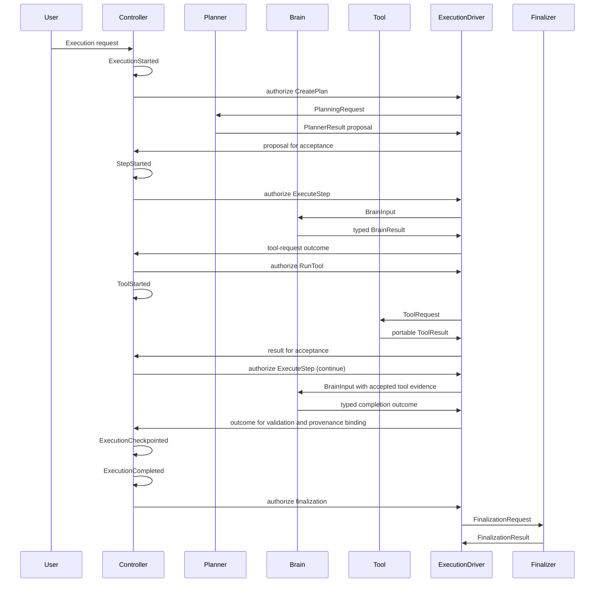

# CEP-002 Execution Lifecycle

- Protocol Family: CortexNode Execution Protocol (CEP)
- Document ID: CEP-002
- Version: 1.0
- Status: Review Candidate
- Layer: Layer 2 (Execution Protocol)

## 1. Purpose
This RFC defines the deterministic lifecycle and transition rules for command/event progression during execution.

## 2. Lifecycle (Normal Path)

StepStarted is the Controller's commitment to execute the step. It does not confirm that Brain has already begun processing. The Controller records the step as active before dispatching ExecuteStep so the execution history reflects the committed order.

## 3. Deterministic State Machine Narrative

Lifecycle phases:
- Initialized: after ExecutionStarted.
- Planned: after PlanCreated or PlanRevised.
- Running: from StepStarted until StepCompleted or StepFailed. WaitingForTool is a substate of Running while deterministic tool completion is pending.
- Paused: after ExecutionPaused until ExecutionResumed.
- Terminal: ExecutionCompleted or ExecutionCancelled.

Controller is the only actor that may move execution across phases.

`PortableExecutionRuntime` owns portable turn preparation, completion assessment,
and revision reconciliation around each Controller transition. `ExecutionDriver`
applies that transition and invokes only the worker it authorizes. These runtime
responsibilities do not transfer lifecycle authority away from Controller.

ExecutionCompleted marks the end of execution. Finalization is terminal reporting,
not another lifecycle transition. Finalizer produces both `ExecutionSummary` and the
final user-facing answer, and never changes the terminal execution outcome.

## 4 Controller Decision Cycle

The Controller executes the same deterministic decision cycle for every accepted protocol event. This cycle is independent of the current lifecycle phase and ensures all CortexNode implementations produce identical execution behavior.

For every accepted protocol event, the Controller performs the following sequence:

1. **Validate**  
   Verify that the received event is legal according to the current execution state and protocol rules.

2. **Record**  
   Commit the event to the immutable execution history.

3. **Checkpoint**  
   Persist a checkpoint when required by the checkpoint policy.

4. **Decide**  
   Determine the next legal command based on the current execution state, protocol rules, and execution policy.

5. **Dispatch**  
   ExecutionDriver invokes the worker selected by the Controller authorization.

This decision cycle is executed for every protocol event until execution reaches a terminal state.

## 5. Transition Rules

### 5.1 Normal Execution
| Current Event | Controller Decision | Next Command | Expected Event |
| ExecutionStarted | Dispatch CreatePlan | CreatePlan | PlanCreated |
| PlanCreated | Dispatch ExecuteStep | ExecuteStep | StepStarted |
| StepStarted | Dispatch ExecuteStep | ExecuteStep | ToolRequested or StepCompleted or StepFailed or ReplanRequested |
| StepCompleted | Dispatch ExecuteStep | ExecuteStep | StepStarted |
| Accepted final StepCompleted | Commit Completion | GenerateFinalization | ExecutionCompleted then FinalizationGenerated |

### 5.2 Tool Execution
| Current Event | Controller Decision | Next Command | Expected Event |
| ToolRequested | Dispatch RunTool | RunTool | ToolStarted |
| ToolStarted | Dispatch RunTool | RunTool | ToolCompleted or ToolFailed |
| ToolCompleted | Dispatch ExecuteStep | ExecuteStep | StepCompleted or StepFailed or ReplanRequested |

### 5.3 Failure and Retry
| Current Event | Controller Decision | Next Command | Expected Event |
| ToolFailed | Schedule Retry | RetryStep | StepStarted |
| ToolFailed | Dispatch ExecuteStep | ExecuteStep | StepFailed |
| StepFailed | Schedule Retry | RetryStep | StepStarted |
| StepFailed | Accept Replan | CreatePlan | PlanRevised |
| StepFailed | Terminate Execution | GenerateFinalization | ExecutionCompleted or ExecutionCancelled then FinalizationGenerated |

### 5.4 Replanning
| Current Event | Controller Decision | Next Command | Expected Event |
| ReplanRequested | Accept Replan | CreatePlan | PlanRevised |
| PlanRevised | Dispatch ExecuteStep | ExecuteStep | StepStarted |

### 5.5 Pause and Resume
| Current Event | Controller Decision | Next Command | Expected Event |
| StepCompleted | Pause Execution | PauseExecution | ExecutionPaused |
| ExecutionPaused | Resume Execution | ResumeExecution | ExecutionResumed |
| ExecutionResumed | Dispatch ExecuteStep | ExecuteStep | StepStarted |

### 5.6 Cancellation
| Current Event | Controller Decision | Next Command | Expected Event |
| Any non-terminal event | Terminate Execution | CancelExecution | ExecutionCancelled |
| ExecutionCancelled | Commit Completion | GenerateFinalization | FinalizationGenerated |

## 6. Illegal Transitions

Illegal transitions are protocol-invalid states that Controller MUST not permit:
- ToolCompleted without prior ToolStarted.
- StepCompleted without prior StepStarted for same step attempt.
- PlanRevised without prior ReplanRequested.
- ExecutionResumed without prior ExecutionPaused.
- Any ExecuteStep or RunTool after terminal event.

Required protocol behavior for illegal transitions:
- preserve recorded history without rewriting prior facts
- reject the invalid transition as non-compliant execution state
- choose only a deterministic recovery path that is still legal
- if recovery is impossible, transition to terminal cancellation/failure handling
- if recovery is possible, continue from the last valid execution state

## 7. Retry Policy Semantics

Retry is a controller decision, not a worker side effect.
- RetryStep creates a new step attempt.
- Previous attempts remain immutable facts.
- Retry limit and backoff policy are protocol configuration, not worker discretion.
- Failure never rewrites execution history.
- Failures create new recorded events.
- Retries create new attempts.
- Replanning creates new recorded plan revisions.
- Completed history remains immutable.
- Failures always append to history and never modify previous facts.

## 8. Replanning Semantics

- Brain cannot alter active plan directly.
- Brain can only propose a typed replan-requested outcome.
- Controller decides to accept or reject replan request.
- Planner returns a request-bound proposal. Controller reconciles it against the
  accepted base revision and alone accepts the resulting revision.
- Completed steps remain immutable across revisions.

## 9. Completion Semantics

Execution is complete only when:
- all required steps are completed, or
- controller reaches terminal cancellation/failure decision.

Finalization is a separate terminal activity authorized by Controller. It consumes a
`FinalizationRequest` and returns a `FinalizationResult` containing the summary and
final answer.

## 9.1 Asynchronous Tool Continuation

When an accepted tool result represents a non-terminal asynchronous job, Controller
may issue an asynchronous-wait decision. A later poll-due wake only correlates the
execution and job; it does not authorize a poll. Controller validates the current
wait, constructs and authorizes the poll `ToolRequest`, ExecutionDriver executes it,
and the portable `ToolResult` is integrated before continuation.

Continuation consists of ordinary portable Controller turns until the next wait or a
terminal decision. It has no protocol node, successor, or graph-resume semantics.

## 10. Failure Protocol

### 10.1 Tool Failure
- Trigger: ToolFailed event.
- Controller behavior: evaluate RetryStep eligibility; if denied, route to StepFailed handling.
- Deterministic outcome: retry, replan path, or terminal decision.

### 10.2 Brain Failure
- Trigger: Brain cannot record valid StepCompleted, StepFailed, or ReplanRequested for active attempt.
- Controller behavior: treat as step failure condition and apply retry/replan policy.
- Deterministic outcome: RetryStep, CreatePlan, or terminal decision.

### 10.3 Planner Failure
- Trigger: Planner cannot record PlanCreated or PlanRevised after CreatePlan.
- Controller behavior: apply planner retry policy or terminate.
- Deterministic outcome: new CreatePlan attempt or terminal decision.

### 10.4 Timeout
- Trigger: command execution exceeds configured timeout boundary.
- Controller behavior: convert to corresponding failure branch (tool, step, or planning timeout domain) and evaluate retry/replan/terminate.
- Deterministic outcome: policy-selected next command and expected event.

### 10.5 Cancelled Execution
- Trigger: CancelExecution accepted.
- Controller behavior: emit ExecutionCancelled and stop dispatching ExecuteStep or RunTool.
- Deterministic outcome: optional finalization then FinalizationGenerated.

### 10.6 Unexpected Exception
- Trigger: unrecoverable protocol-processing error.
- Controller behavior: record terminal cancellation/failure path and prevent further non-terminal commands.
- Deterministic outcome: ExecutionCancelled and optional FinalizationGenerated.

### 10.7 Checkpoint Recovery
- Trigger: recovery from interruption or restart condition.
- Controller behavior: restore from latest valid checkpoint, validate cursor alignment, record ExecutionResumed on success.
- Deterministic outcome: continue at resume cursor; if validation fails, follow terminal cancellation/failure path.

## 11. Current Implementation Conformance Boundary

The lifecycle authority and typed worker-result flow above describe the current
production runtime. The record/checkpoint portions of the Validate-Record-Checkpoint-
Decide-Dispatch cycle remain normative CEP requirements, but current production does
not implement a complete append-only accepted-event journal, deterministic
framework-neutral replay, or protocol-level atomic checkpoint/event-position commit.
Those are explicit non-conformance items reserved for the separate Stage 8 decision.
