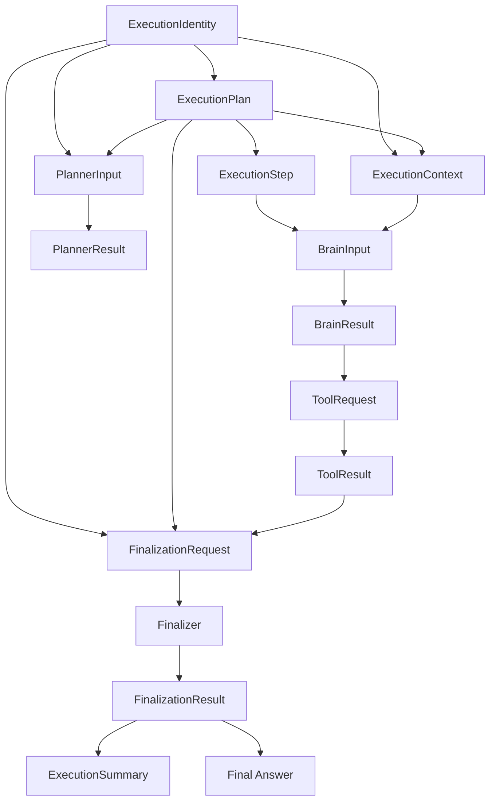

# CEP-005 Protocol Data Contracts

- Protocol Family: CortexNode Execution Protocol (CEP)
- Document ID: CEP-005
- Version: 1.0
- Status: Review Candidate
- Layer: Layer 2 (Execution Protocol)

## 1. Purpose
This RFC defines the canonical protocol data contracts exchanged between workers.

CEP-005 defines protocol concepts only. It does not define implementation classes, runtime internals, or representation formats.

## 2. Scope
Included:
- immutable protocol contract semantics
- ownership and exchange boundaries
- required and optional contract fields at protocol meaning level
- contract invariants and CEP cross-references

Excluded:
- implementation language models
- representation formats
- persistence or transport design

## 3. Design Principles
Every contract in CEP-005 is:
- immutable once created
- implementation independent
- transport independent
- deterministic
- versionable
- uniquely identifiable where appropriate

Contracts define protocol meaning. They do not define representation details.

## 4. Shared Contract Principles

- Contracts are immutable protocol facts once accepted.
- Contracts are versionable and must be interpretable with protocol version context.
- Contracts have stable identities for correlation, auditability, and replay validation.
- Contracts never contain hidden reasoning.
- Contracts never expose implementation state.
- Contracts are deterministic in interpretation.
- Contracts are protocol concepts rather than implementation classes.
- Contract ownership follows CEP-004 worker authority boundaries.

## 5. Shared Identity Model

This section defines the protocol identity concepts used across all contracts.

- Execution Identity: Identifies one execution instance across its full lifecycle.
- Plan Identity: Identifies a logical plan associated with an execution.
- Plan Revision Identity: Identifies one accepted revision of a plan.
- Step Identity: Identifies a logical step within a plan.
- Step Attempt Identity: Identifies one attempt to complete a step.
- Operation Identity: Identifies a logical tool operation requested by protocol flow.
- Operation Attempt Identity: Identifies one attempt of an operation when retries occur.
- Finalization identity is the terminal Execution Identity; the current contract does
  not introduce a separate Summary Identity.

Identity rules:
Identities are protocol concepts rather than storage identifiers, database keys, memory addresses, or implementation-specific object references.
- Logical identities remain stable for the lifetime of the logical unit they identify.
- Revision and attempt identities change when new revisions or retries are created.
- New revisions and attempts never modify historical facts.

## 6. Contract Specifications

### 6.1 ExecutionIdentity
Purpose:
- Represents one execution instance across its full lifecycle.

Definition:
- Represents the canonical protocol contract that uniquely identifies one execution instance throughout its lifecycle.

Canonical Owner:
- Controller.

Produced By:
- Controller at execution start.

Consumer:
- Planner, Brain, Tool Runtime, Finalizer, and protocol observers.

Required Contract Elements:
- execution identity
- protocol version
- creation identity

Optional Contract Elements:
- correlation identity for multi-request traceability

Invariants:
- execution identity is unique within protocol scope
- execution identity never changes during execution
- protocol version is fixed for that execution identity
- creation identity remains associated with the same execution identity for its full lifecycle

Related CEP references:
- CEP-001 (ExecutionStarted and common metadata)
- CEP-003 (ExecutionState and invariants)
- CEP-004 (Controller ownership)

### 6.2 ExecutionPlan
Purpose:
- Represents the accepted plan used for execution coordination.

Definition:
- Represents the canonical protocol contract for the currently accepted plan revision.

Canonical Owner:
- Controller.

Produced By:
- Planner produces plan candidates.
- Controller accepts the plan revision used by protocol flow.

Consumer:
- Controller, Brain, Finalizer.

Required Contract Elements:
- plan identity
- revision identity
- execution goal
- ordered steps
- planning metadata

Optional Contract Elements:
- planning rationale visible to protocol participants

Invariants:
- accepted plan content is immutable
- Plan Identity remains stable for the logical plan lineage
- Plan Revision Identity changes for each accepted revision
- completed work from prior revisions remains immutable

Related CEP references:
- CEP-001 (PlanCreated, PlanRevised)
- CEP-002 (replanning transitions)
- CEP-004 (Planner and Controller boundaries)

### 6.3 ExecutionStep
Purpose:
- Represents one executable unit within an execution plan.

Definition:
- Represents the canonical protocol contract for a logical step and its attempt-aware progression facts.

Canonical Owner:
- Controller.

Produced By:
- Planner defines step candidates in plan content.
- Controller records step progression facts for accepted steps.

Consumer:
- Controller, Brain, Finalizer.

Required Contract Elements:
- step identity
- step order
- step intent
- completion status
- retry metadata

Optional Contract Elements:
- step-local constraints visible to Brain

Invariants:
- Step Identity remains stable across execution history
- Step Attempt Identity changes for retries
- completed steps never change
- retries create new attempts, not rewritten attempts

Related CEP references:
- CEP-001 (StepStarted, StepCompleted, StepFailed)
- CEP-002 (retry and completion rules)
- CEP-003 (immutable ledger semantics)

### 6.4 ExecutionContext
Purpose:
- Represents protocol-visible context available to workers for current execution decisions.

Definition:
- Represents the canonical protocol contract assembled for worker consumption at a specific execution point.

Canonical Owner:
- Controller.

Produced By:
- Controller.

Consumer:
- Planner, Brain, Finalizer, and Tool Runtime when required by command scope.

Required Contract Elements:
- execution identity
- active plan
- current step
- relevant history
- execution cursor

Optional Contract Elements:
- policy constraints visible to receiving worker

Invariants:
- includes only protocol-visible information
- excludes hidden reasoning
- reflects accepted protocol facts only
- is assembled exclusively by Controller from accepted protocol facts
- workers consume ExecutionContext but never modify it directly
- never contains implementation-specific state

Related CEP references:
- CEP-001 (worker communication boundaries)
- CEP-003 (execution cursor and reconstruction rules)
- CEP-004 (controller mediation)

### 6.5 BrainInput
Purpose:
- Represents the information supplied to Brain for one step attempt.

Definition:
- Represents the canonical protocol contract that scopes Brain processing to one step attempt and visible context.

Canonical Owner:
- Controller.

Produced By:
- Controller.

Consumer:
- Brain.

Required Contract Elements:
- active step
- execution context
- relevant tool results
- applicable constraints

Optional Contract Elements:
- step-attempt metadata

Invariants:
- scoped to one active step attempt
- contains only protocol-visible inputs
- cannot grant lifecycle ownership to Brain
- references exactly one Step Attempt Identity

Related CEP references:
- CEP-001 (ExecuteStep semantics)
- CEP-002 (step ordering)
- CEP-004 (Brain permissions)

### 6.6 BrainResult
Purpose:
- Represents Brain outcome for one step attempt.

Definition:
- Represents the canonical protocol contract for one step-attempt outcome produced by Brain.

Canonical Owner:
- Controller.

Produced By:
- Brain.

Consumer:
- Controller.

Required Contract Elements:
- step-attempt identity
- Outcome

Optional Contract Elements:
- protocol-visible rationale for outcome

Invariants:
- Outcome is mutually exclusive and exactly one of the implemented typed outcomes:
  - `TOOL_REQUEST`
  - `STEP_COMPLETED`
  - `STEP_FAILED`
  - `REPLAN_REQUEST`
  - `FINAL_ANSWER`
  - `CONTINUE`
  - `INVALID_OUTPUT`
  - `PROVIDER_FAILURE`
- exactly one Outcome exists for each Brain invocation
- a step attempt may require multiple Brain invocations around tool observations
- Brain supplies only semantic completion evidence; Controller binds execution,
  accepted plan revision, active step, and eligible tool-result provenance before
  accepting completion
- BrainResult never transitions execution directly

Related CEP references:
- CEP-001 (domain and runtime events)
- CEP-002 (transition decisions)
- CEP-004 (Controller authority)

### 6.7 ToolRequest
Purpose:
- Represents one deterministic tool operation request.

Definition:
- Represents the canonical protocol contract for a deterministic operation request routed through Controller.

Canonical Owner:
- Controller.

Produced By:
- Brain proposes tool operation intent.
- Controller dispatches operation under protocol authority.

Consumer:
- Tool.

Required Contract Elements:
- request identity
- tool identity
- operation parameters
- correlation identity

Optional Contract Elements:
- execution constraints relevant to tool operation

Invariants:
- Request Identity identifies the exact authorized operation
- one ToolRequest identifies one operation intent, including an authorized async poll
- ToolRequest does not encode execution policy decisions

Related CEP references:
- CEP-001 (RunTool and ToolRequested)
- CEP-002 (tool execution transitions)
- CEP-004 (Tool contract)

### 6.8 ToolResult
Purpose:
- Represents one completed tool operation outcome.

Definition:
- Represents the canonical protocol contract for one operation-attempt result used by Controller and Brain.

Canonical Owner:
- Controller.

Produced By:
- Tool.

Consumer:
- Controller and Brain.

Required Contract Elements:
- matching request identity
- success or failure outcome
- returned observations
- execution metadata

Optional Contract Elements:
- failure detail visible at protocol level
- asynchronous job identity and non-terminal/terminal status

Invariants:
- ToolResult corresponds to the exact current authorized ToolRequest identity
- ToolResult records observations, not policy
- ToolResult never determines execution policy
- asynchronous wake correlation is not poll authorization

Related CEP references:
- CEP-001 (ToolCompleted, ToolFailed)
- CEP-002 (failure and retry paths)
- CEP-004 (Controller-owned decisions)

### 6.9 PlanningRequest
Purpose:
- Represents information supplied to Planner for new planning or replanning.

Definition:
- Represents the canonical protocol contract for planner-visible execution intent and immutable progress context.

Canonical Owner:
- Controller.

Produced By:
- Controller.

Consumer:
- Planner.

Required Contract Elements:
- execution goal
- request and planning-episode identity
- CREATE or REVISE operation
- accepted base revision and completed work for REVISE
- bounded observable progress projection for REVISE
- typed clarification for a resumed episode when applicable

Optional Contract Elements:
- protocol-visible planning constraints

Invariants:
- completed work is immutable input to planning
- planning input cannot alter recorded history
- planning scope remains within protocol-visible context
- references one active Plan Revision Identity as planning baseline

Related CEP references:
- CEP-001 (CreatePlan, ReplanRequested)
- CEP-002 (replanning transitions)
- CEP-004 (Planner boundaries)

### 6.10 PlannerResult
Purpose:
- Represents planner output after planning or replanning.

Definition:
- Represents one request-bound structured Planner outcome. A plan is only a candidate
  when the outcome is `PLAN_PROPOSED`.

Canonical Owner:
- Controller.

Produced By:
- Planner.

Consumer:
- Controller.

Required Contract Elements:
- matching PlanningRequest identity
- typed outcome and its outcome-specific payload

Optional Contract Elements:
- plan change summary

Invariants:
- planner output does not transition execution directly
- controller determines transition after accepting planner result
- completed history remains immutable
- one PlannerResult corresponds to one PlanningRequest identity
- only Controller may accept a proposed plan or choose lifecycle state
- proposal revision/status values do not acquire lifecycle authority; accepted
  revision identity and preserved completed work are determined by Controller-owned
  reconciliation

Related CEP references:
- CEP-001 (PlanCreated, PlanRevised)
- CEP-002 (controller decisions)
- CEP-004 (Planner non-permissions)

### 6.11 FinalizationRequest
Purpose:
- Represents accepted terminal execution information supplied to Finalizer.

Definition:
- Represents the canonical request for summary and final-answer generation using
  terminal execution facts.

Canonical Owner:
- Controller.

Produced By:
- Controller.

Consumer:
- Finalizer.

Required Contract Elements:
- execution identity and terminal status
- terminal execution context and accepted plan, when any
- accepted tool execution history and completed-step identities
- terminal reason, direct-response classification, and cancellation source

Optional Contract Elements:
- final-answer rendering constraints visible at the application boundary

Invariants:
- finalization input is derived from accepted terminal facts
- finalization input excludes hidden reasoning
- finalization input does not alter execution outcome
- references a terminal execution identity and corresponding immutable history

Related CEP references:
- CEP-001 (GenerateFinalization, FinalizationGenerated)
- CEP-002 (completion semantics)
- CEP-004 (Finalizer contract)

### 6.12 FinalizationResult and ExecutionSummary
Purpose:
- Represents terminal reporting returned by Finalizer.

Definition:
- `FinalizationResult` contains the authoritative `ExecutionSummary`, final
  user-facing answer, and optional rendering error.

Canonical Owner:
- Controller.

Produced By:
- Finalizer.

Consumer:
- Controller and observers.

Required Contract Elements:
- `ExecutionSummary` with execution outcome, completed work, failures, and summary text
- non-empty final user-facing answer

Optional Contract Elements:
- protocol-visible explanatory narrative

Invariants:
- summary reflects accepted protocol facts only
- summary never modifies protocol history
- summary does not alter terminal execution outcome
- final-answer rendering failure is represented without changing terminal outcome

Related CEP references:
- CEP-001 (FinalizationGenerated)
- CEP-002 (terminal finalization activity)
- CEP-004 (Finalizer non-permissions)

## 7. Protocol Data Model

The following diagram defines conceptual protocol data relationships only. It does not define runtime sequencing or execution transitions.

## 8. Out of Scope
CEP-005 does not define:
- implementation classes
- representation schemas
- persistence design
- transport or interface protocols
- runtime engine internals

## 9. Global Contract Invariants

- Contracts are immutable once accepted.
- Contracts are never rewritten.
- Contracts are interpreted using protocol version.
- Contracts may reference one another through stable identities.
- Contracts never contain hidden reasoning.
- Contracts never expose implementation state.
- Contracts never imply execution transitions.
- Controller remains the sole authority that accepts protocol-visible state.

## 10. Compatibility Notes
CEP-005 is fully compatible with CEP-001 through CEP-004.

- CEP-001 defines command and event vocabulary.
- CEP-002 defines lifecycle and transition behavior.
- CEP-003 defines execution state, checkpoint, resume, and replay semantics.
- CEP-004 defines worker authority boundaries.

CEP-005 defines the canonical protocol data language used across those behaviors.
