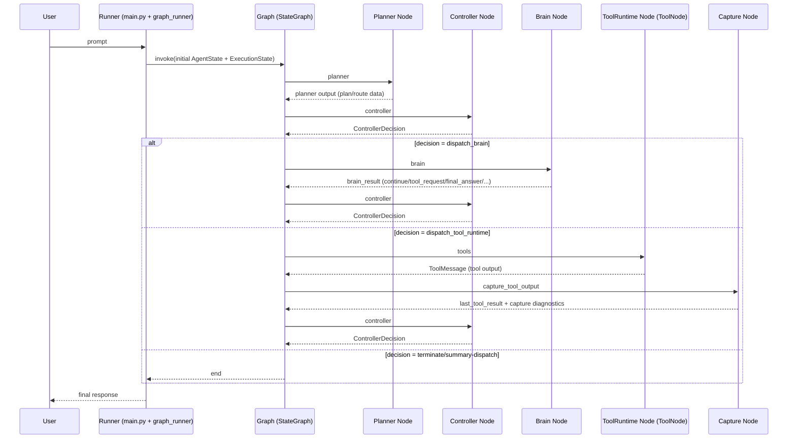

# 1. Runtime Flow

# 2. Graph
Current registered nodes from graph.py and factories in graph_nodes.py.

1. planner
- purpose: create/revise plan and planning metadata.
- input: AgentState (including ExecutionState + messages/context).
- output: planner_result-related update for controller consumption.
- owner: Planner component.

2. controller
- purpose: choose legal next step and apply decision to ExecutionState.
- input: AgentState (latest planner/brain/tool outputs).
- output: execution_state update + controller_decision (+ final_answer passthrough when present).
- owner: Controller component.

3. brain
- purpose: produce one step outcome (tool request / continue / replan / final answer).
- input: AgentState scoped into BrainInput.
- output: brain_result (+ optional AI response messages).
- owner: Brain component.

4. tools
- purpose: execute deterministic tool call.
- input: AgentState with latest AI tool_call transport.
- output: ToolMessage(s) in messages.
- owner: ToolRuntime component.

5. capture_tool_output
- purpose: normalize ToolMessage into protocol ToolResult + capture diagnostics.
- input: AgentState with latest ToolMessage.
- output: last_tool_result, repeat_fail_count, brain_result reset.
- owner: Capture component.

6. summarize_memory (registered but deferred in active termination path)
- purpose: terminal summarization/final answer packaging.
- input: AgentState terminal context.
- output: rolling_summary + final answer message packaging.
- owner: Summary component.

Live orchestration edges:
- planner -> controller
- controller -> conditional route_after_controller
- brain -> controller
- tools -> capture_tool_output -> controller
- summarize_memory -> END

# 3. Protocol
Implemented protocol models in models.py.

Inputs
- PlannerInput
- BrainInput
- ToolInput
- ControllerInput

Outputs
- PlannerResult
- BrainResult
- ToolResult
- ReplanRequest
- ExecutionSummary
- EventRecord

State
- ExecutionIdentity
- ExecutionCursor
- ExecutionPlan
- ExecutionStep
- RetryMetadata
- ProtocolVisibleState
- WorkingState
- ExecutionState
- ExecutionContext
- CheckpointState

Decisions
- ControllerDecision
- Decision enum space in enums.py:
  - DISPATCH_PLANNER
  - DISPATCH_BRAIN
  - DISPATCH_TOOL_RUNTIME
  - DISPATCH_SUMMARY
  - REQUEST_REPLAN
  - PAUSE
  - RESUME
  - CANCEL
  - TERMINATE

# 4. Component Status
- Planner: Complete
- Brain: Complete
- Controller: Stable
- ToolRuntime: Complete
- Capture: Complete
- Bridge: Migration
- Summary: Partial
- Graph: Stable
- Protocol Models: Stable

# 5. Remaining Legacy
Only current migration shims still in runtime path:

1. graph.py
- why it exists: rewrites first tool_call id from pending protocol request_id before ToolNode execution.
- remove after: ToolRuntime no longer depends on AIMessage/ToolMessage id transport and executes purely from protocol ToolInput/request envelope.

2. graph_capture.py
- why it exists: ToolResult request_id fallback chain (tool_call_id/signature/uuid) for mixed transport states.
- remove after: request_id is guaranteed end-to-end from controller-accepted ToolRequest through tool execution and capture.

3. bridge.py
- why it exists: dual translation between legacy runtime dict shape and protocol models.
- remove after: runtime state is protocol-native only (no legacy flat keys consumed/emitted).

4. bridge.py
- why it exists: build_tool_input fallback path when pending_tool_request is missing.
- remove after: pending_tool_request is always present and authoritative for tool execution inputs.

5. graph_runner.py
- why it exists: explicit coexistence boundary where legacy runtime state and protocol ExecutionState are synchronized.
- remove after: single authoritative protocol state path is used at runner boundary without legacy mirror expectations.

# 6. Missing Features
Designed but not fully implemented end-to-end in the live runtime:

1. Full protocol event lifecycle (validate -> record immutable event history -> checkpoint -> decide -> dispatch) as mandatory per-cycle behavior.
2. Protocol-native checkpoint manager flow (beyond current local session persistence pattern).
3. Full use of decision types REQUEST_REPLAN / PAUSE / RESUME / CANCEL in live controller-to-graph routing.
4. Complete illegal-transition enforcement matrix from protocol docs.
5. Retry/backoff policy semantics as explicit controller policy layer (not only partial counters/flags).
6. Controller-driven terminal summary path fully active (currently deferred in effective routing path).

# 7. Risks
Top 10 technical risks:

1. Tool transport still depends on message-id rewriting shim in graph orchestration.
2. Bridge remains a high-coupling migration surface (dual legacy/protocol translation).
3. Protocol decision enum includes paths not fully realized in live graph routing.
4. Summary terminal path is deferred, creating potential drift between protocol intent and runtime termination behavior.
5. Mixed legacy/protocol fields can create subtle precedence/order bugs during state assembly.
6. Request-id integrity relies on transport adaptation rather than native protocol execution input.
7. Partial event-history semantics increase replay/recovery ambiguity under failures.
8. Checkpoint semantics are not yet fully protocol-governed.
9. Controller/graph behavior can diverge from documented CEP transition tables if deferred branches persist.
10. Integration tests cover major flows but not every protocol illegal-transition edge case.

# 8. Recommended Next Component
Summary

Reason: it is the highest-value missing feature that closes the controller-selected terminal path and user-facing completion behavior without redesigning the architecture.